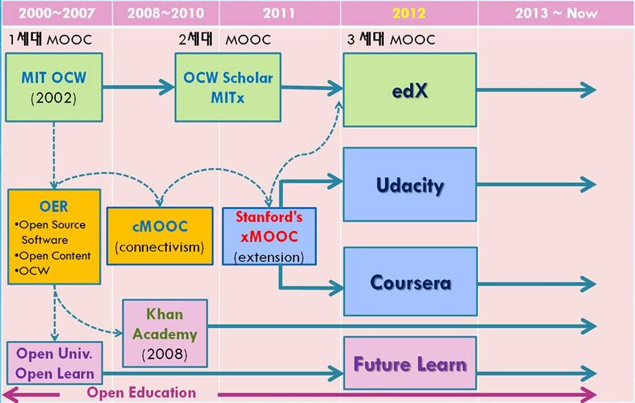

## 세가지 사고체계

카네기멜론 대학의 쟈넷 윙 교수는 이론적 사고(Theoretical Thinking), 실험적 사고(Experimental Thinking)와 더불어 컴퓨터적 사고(Computational Thinking)가 향후 인간의 사고 체제를 지배하는 중추적인 역할을 할 것이라고 주장했다. 산업혁명 이후로 산업, 즉 공장에서 필요한 인력을 육성하고 공급하기 위해서 수학과 공학을 초중등 과정에서 집중적으로 학습하여 국내 및 전세계 누구나 이론적 사고체계는 익숙하고 친숙하다. 통계가 근간을 이루는 실험적 사고는 스몰 데이터(Small Data)를 일부 초중등에서 접하고 있지만, 학교를 졸업하고 현실에서 가장 많이 접하게 되고 필수적인 것임에도 충분한 교육을 받지 못하고 있다. 그러는 와중에 빅데이터(Big Data)가 10년도 되지 않는 짧은 시간에 성급 우리곁에 다가왔다.

컴퓨터적 사고와 통계적 사고를 배운 사람과 그렇지 못한 사람과의 차이는 산업경제 체제에서 빈부격차보다 더욱 커다란 디지털 경제의 정보 불평등(Digital Divide)를 야기할 것으로 예측되고 있고, 준비를 잘하고 변환된 환경에 잘 적응한 사람들은 과거보다 훨씬 더 변화된 환경을 기회로 잘 활용하고 있다. 다른 한편에서는 컴퓨터적 사고와 통계적 사고의 차이를 줄이기 위해 설사 학교를 졸업한 사람도 누구나 재교육 받고 평생교육을 받아 다시 시작하는데 도움될 수 있도록 다양하고 활발한 교육과정이 펼쳐져 있고, 본고에서는 이를 통계학 중심으로 소개하고자 한다.

## 21세기 통계학 

현재 및 향후 통계학은 컴퓨터 과학과 밀접한 관계를 갖고 지속적으로 발전해 나갈 것으로 예상된다. 사실 통계학 뿐만 아니라 다른 모든 학문 분야가 `Computation-X` 라는 이름으로 진화하고 있다. 일부 예를 들면, 컴퓨터 생명공학(Computational Biology), 계산 통계학(Computational Statistics), 계산 물리학(Computational Physics), 컴퓨터 화학(Computational Chemistry) 등이 있다.
통계학도 기존 수학 및 이론 통계를 중심에 두고 컴퓨터를 접목하려는 시도도 있지만, 컴퓨터 과학 중심에서 통계학을 접근하는 움직임도 확연히 나타나고 있다. 하지만, 두가지 접근 방법 모두 무료이며 공개된 교육 방법을 취하고 있다는 점에서는 공통점이 많다.

### 공개기초 통계학 (OpenIntro Statistics)

OpenIntro는 통계학에서 출발하지만 무료이며, 투명하고, 진입장벽을 낮춘 교육제품을 만들어 공유하는 것을 미션으로 하고 있다. 통계학 개론, 고급 고등학교 교과서 및 실험계획법과 모의시험 개론서 총 3권을 온라인 PDF 전자책 형태는 무료, 만약 종이책을 원하면 8.5 달러에 아마존에서 구매할 수 있다. 통계학에서 중요하게 다루는 두가지 프로그래밍 언어인 SAS와 R을 모두 지원한다. 핵심적인 개념을 교과서를 통해서 익히고 난 후 SAS 코드와 R 코드를 통해서 실제 다양한 데이터를 가지고 실습을 할 수 있다. 한글번역이 이제 시작되어 관심있는 분들의 많은 참여가 필요하다.

웹사이트 : https://www.openintro.org/

### 통계적으로 생각하기 (Think Stats)

생각하기 시리즈로 유명한 Allen B. Downey 교수님의 저서 중에 통계를 집중적으로 다루고 있으며, 부제는 프로그래머를 위한 확률과 통계다. "Think Python"으로 컴퓨터 과학자처럼 컴퓨터적 사고를 배웠다면, 통계적으로 생각하기를 통해서 통계적 사고를 배울 수 있다. 파이썬은 역사가 길지 않은 신생 컴퓨터 언어지만, 교육용 언어로 출발해서 높은 생산성을 지니고 있으며 강력한 과학과 공학 라이브러리를 바탕으로 최근에는 빅데이터, 데이터 시각화, 대용량 자료 분석 등 프로그래밍으로 출발한 사람들이 통계를 다루는 강력한 언어로 부상하였다.
초판은 한글로 번역되어 시중에서 구할 수 있으며, 개정판은 한글 번역이 xwMOOC에서 진행중에 있으며 https://github.com/statkclee/ThinkStats2 웹사이트에서 번역에 참여할 수 있으며, 번역된 출판물을 무료로 다운로드 받을 수도 있다. 통계적으로 생각하기 책은 초판은 통계를 기반으로 이론을 설명하고 실제 데이터를 가지고 파이썬으로 통계 프로그램을 작성하는 방향에서 개정판에서는 방향이 바뀌어서 파이썬 프로그램 중심으로 실제 데이터를 가지고 시각화 및 추론을 보여주고 나서 마지막에 이론적인 부분은 한장만 다루고 있다.

웹사이트 : http://greenteapress.com/thinkstats/

## 온라인 공개수업 (Massive Open Online Course, MOOC)

집체교육에 반대되는 혹은 보완되는 교육 개념으로 온라인 교육은 과거 라디오, TV, 인터넷 교육 등 기술의 발전과 더불어 진화해왔다. 2000년대 초반 미국 MIT 대학이 OCW (OpenCourseWare)로 모든 강의를 인터넷에 공개한 것이 얼마 지나지 않아 스탠포드 대학에서 Andrew Ng 교수의 기계학습(Machine Learning)과 Sebastian	Thrun 교수의 인공지능(Artificial Intelligence)을 인터넷 강의로 공개했는데 기존의 학습관리시스템(LMS, Learning Management System)가 수백 수천명을 교육했다면 온라인 공개수업은 기본이 수십만이 되는 엄청난 규모다. 하지만, 수강생이 많다고 전통적인 개념에서 비추어 봤을 때, 교육의 질이 떨어지거나 수강생 만족도가 결코 낮지 않다.

### 코세라 (Coursera)

스탠포드 대학교의 컴퓨터 공학 교수 Andrew NG와 Daphone Koller가 설립하였으며, 코세라(Coursera)는 2012년 2월, 시험운영을 거쳐서, 그해 4월 공식적으로 운영시작 하였다. Widom가 데이터베이스과목, Andrew Ng이 기계학습 온라인 강의를 시작한 것에 뿌리를 두고 있다.

웹사이트 : https://www.coursera.org/

### edX

2014년 10월 기준으로 300개가 넘은 과정과 3백만명의 수강생을 기록하고 있으며, 2012년 5월 MIT와 하바드 대학이 주측이 되어 서립되었다.

MIT와 하바드 대학이 

### 유대서티(Udacity)

유대서티는 Sebastian Thrun, David Stavens, Mike Sokolsky 설립한 비영리 교육기관으로 Sebastian Thrun 교수가 스탠포드 대학에서 2011년 인공지능(Artificial Intelligence)을 인터넷 강의로 공개 것에 기원을 두고 있다.

